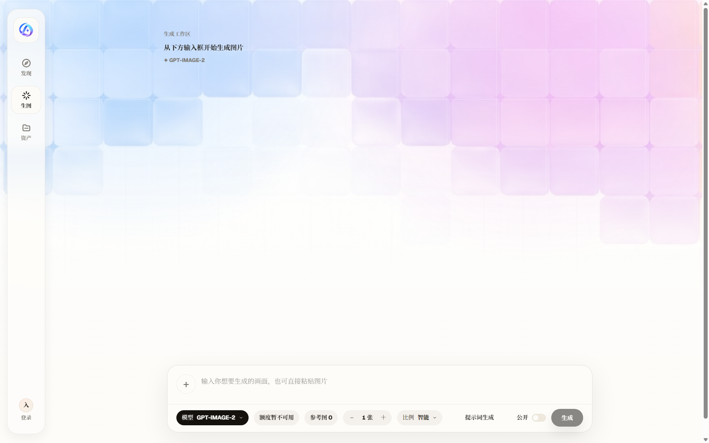
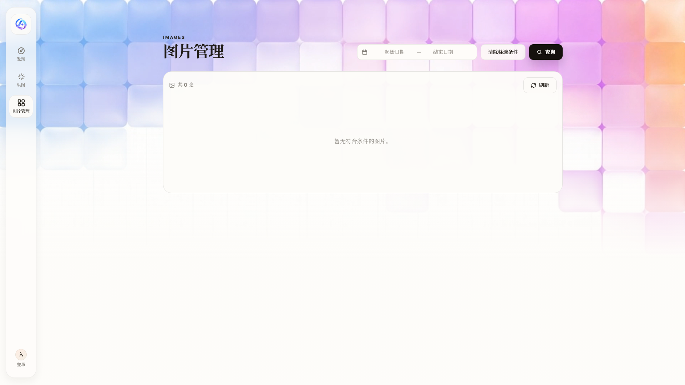

<h1 align="center">贝尔灵画</h1>

<p align="center">免费闭环的 AI 图像生成工作台</p>
<p align="center">提示词生图 · 参考图生图 · 资产历史 · 用户额度管理</p>

<p align="center">
  <a href="#功能亮点">功能亮点</a> ·
  <a href="#页面截图">页面截图</a> ·
  <a href="#docker-compose-快速启动">Docker Compose</a> ·
  <a href="#本地开发">本地开发</a> ·
  <a href="#api-入口">API</a>
</p>

---

贝尔灵画 面向需要稳定创作、回看、复用和管理 AI 图像结果的个人创作者与小团队。它把发现灵感、生成图片、查看资产、公开作品和管理员额度控制放在同一个产品界面里，尽量减少噪音，保留清晰的创作节奏。

## 页面截图

| 发现页                                   | 生图工作区                                       | 资产页                                      |
| ---------------------------------------- | ------------------------------------------------ | ------------------------------------------- |
|  |  |  |

## 功能亮点

- 提示词生图：支持模型、数量、比例和公开状态配置。
- 参考图生图：上传参考图后由后端接收文件并保存本地输出。
- 发现页灵感输入：内置流式提示词示例，帮助用户快速开始。
- 生图工作区：保留本次会话中的生成记录，方便连续对比。
- 资产页：按日期整理个人生成历史，支持预览详情和删除。
- 公开画廊：通过公开开关控制作品是否进入公开展示。
- 登录体系：Better Auth 用户名/密码登录，可选 Google OAuth。
- 管理员控制台：创建用户、删除普通用户、设置每日生图额度。
- OpenAI-compatible API：提供 `/v1/images/generations` 入口，方便外部客户端复用。

## 技术栈

| 层         | 技术                                                           |
| ---------- | -------------------------------------------------------------- |
| Frontend   | Vue 3, Vue Router, TypeScript, Vite, Element Plus, Vitest      |
| Backend    | Node.js, Express, TypeScript, Better Auth, SQLite, Drizzle ORM |
| Storage    | SQLite 数据库, 本地上传目录, 本地输出目录                      |
| Deployment | Docker Compose, nginx, persistent Docker volumes               |

## Docker Compose 快速启动

Docker Compose 适合单机本地或轻量生产式部署。后端容器运行编译后的 Express 服务，启动时自动执行 Drizzle migrations；前端容器使用 nginx 托管 Vite 静态产物，并代理 `/api`、`/v1` 和 `/outputs` 到后端。

> Compose 只读取仓库根目录 `.env` 进行变量插值，不读取 `backend/.env` 或 `frontend/.env`。

### 1. 准备环境变量

```bash
cp .env.docker.example .env
```

至少填写：

```env
IMAGE_API_BASE_URL=https://api.2api.example
# 可选：管理员 2K/4K 专用上游，例如 Codex 图像通道。
HIGH_RES_IMAGE_API_BASE_URL=
IMAGE_API_KEY=replace-me
OPENAI_COMPAT_API_KEY=replace-me-openai-compat
BETTER_AUTH_SECRET=replace-me-with-a-random-32-byte-secret
```

常用公开访问配置：

```env
FRONTEND_PORT=5173
BACKEND_PORT=3000
FRONTEND_ORIGIN=http://localhost:5173
CORS_ORIGIN=http://localhost:5173
BETTER_AUTH_URL=http://localhost:5173
VITE_API_BASE_URL=http://localhost:5173
```

如需启用 Google 登录，在 `.env` 中填写：

```env
GOOGLE_CLIENT_ID=...
GOOGLE_CLIENT_SECRET=...
```

Google OAuth 回调地址配置为：

```text
http://localhost:5173/api/auth/callback/google
```

### 2. 启动服务

```bash
docker compose up --build
```

后台启动：

```bash
docker compose up -d --build
```

启动后访问：

```text
http://localhost:5173
```

查看日志：

```bash
docker compose logs -f backend frontend
```

停止容器但保留数据卷：

```bash
docker compose down
```

如需同时清空数据库、上传参考图和生成结果：

```bash
docker compose down -v
```

## 本地开发

### 1. 安装依赖

```bash
npm --prefix backend install
npm --prefix frontend install
```

### 2. 配置环境变量

```bash
cp backend/.env.example backend/.env
cp frontend/.env.example frontend/.env
```

后端至少需要：

```env
IMAGE_API_BASE_URL=https://api.2api.example
# 可选：管理员 2K/4K 专用上游，例如 Codex 图像通道。
HIGH_RES_IMAGE_API_BASE_URL=
IMAGE_API_KEY=replace-me
OPENAI_COMPAT_API_KEY=replace-me-openai-compat
BETTER_AUTH_SECRET=replace-me-with-a-random-secret
```

常用后端配置：

```env
PORT=3000
FRONTEND_ORIGIN=http://localhost:5173
BETTER_AUTH_URL=http://localhost:3000
SQLITE_PATH=./data/app.sqlite
DAILY_USER_QUOTA=20
```

本地 Google OAuth 回调地址：

```text
http://localhost:3000/api/auth/callback/google
```

本地演示可开启默认管理员种子：

```env
SEED_DEFAULT_ADMIN=true
```

开启后后端启动时会创建或提升默认管理员账号。生产环境不要使用弱默认凭据，请关闭该选项并使用安全账号策略。

### 3. 启动后端

```bash
npm --prefix backend run dev
```

后端默认监听：

```text
http://localhost:3000
```

### 4. 启动前端

```bash
npm --prefix frontend run dev
```

前端默认监听：

```text
http://localhost:5173
```

## 环境变量

| 变量                          | 必需 | 说明                                                                  |
| ----------------------------- | ---- | --------------------------------------------------------------------- |
| `IMAGE_API_BASE_URL`          | 是   | 图像生成服务地址                                                      |
| `HIGH_RES_IMAGE_API_BASE_URL` | 否   | 管理员 2K/4K 专用图像生成服务地址；留空则复用 `IMAGE_API_BASE_URL`    |
| `IMAGE_API_KEY`               | 是   | 图像生成服务密钥                                                      |
| `OPENAI_COMPAT_API_KEY`       | 是   | OpenAI-compatible API 调用密钥                                        |
| `BETTER_AUTH_SECRET`          | 是   | Better Auth 会话密钥                                                  |
| `IMAGE_MODEL`                 | 否   | 默认图像模型，默认 `gpt-image-2`                                      |
| `HIGH_RES_IMAGE_MODEL`        | 否   | 管理员 2K/4K 专用模型名，例如 `codex-gpt-image-2`；留空则沿用请求模型 |
| `IMAGE_API_TIMEOUT_MS`        | 否   | 图像生成请求超时时间                                                  |
| `GPT_POOL_QUOTA`              | 否   | 后端图像生成池额度配置                                                |
| `UPLOAD_MAX_BYTES`            | 否   | 参考图上传大小上限                                                    |
| `DAILY_USER_QUOTA`            | 否   | 默认用户每日生图额度                                                  |
| `GOOGLE_CLIENT_ID`            | 否   | Google OAuth Client ID                                                |
| `GOOGLE_CLIENT_SECRET`        | 否   | Google OAuth Client Secret                                            |
| `SEED_DEFAULT_ADMIN`          | 否   | 是否启用默认管理员种子                                                |

## 页面入口

| 路径           | 说明                                       |
| -------------- | ------------------------------------------ |
| `/`            | 发现页，展示提示词输入、流式示例和公开画廊 |
| `/generate`    | 生图工作区，保留生成记录和结果流           |
| `/history`     | 个人资产页，查看和管理本地生成历史         |
| `/admin/users` | 管理员用户管理页，仅管理员可用             |

## API 入口

| 方法     | 路径                         | 说明                         |
| -------- | ---------------------------- | ---------------------------- |
| `GET`    | `/api/health`                | 健康检查                     |
| `POST`   | `/api/images/generations`    | 应用内生图接口               |
| `GET`    | `/api/history`               | 读取当前用户历史             |
| `POST`   | `/api/history`               | 写入生成历史                 |
| `GET`    | `/api/auth/me`               | 读取当前用户资料和管理员状态 |
| `GET`    | `/api/admin/users`           | 管理员查看用户列表           |
| `POST`   | `/api/admin/users`           | 管理员创建用户               |
| `PATCH`  | `/api/admin/users/:id/quota` | 管理员设置用户每日额度       |
| `DELETE` | `/api/admin/users/:id`       | 管理员删除普通用户           |
| `POST`   | `/v1/images/generations`     | OpenAI-compatible 生图接口   |

## 存储说明

| 场景          | 本地开发默认位置          | Docker Compose 默认位置  |
| ------------- | ------------------------- | ------------------------ |
| SQLite 数据库 | `backend/data/app.sqlite` | `backend-data` volume    |
| 上传参考图    | `backend/tmp/uploads`     | `backend-uploads` volume |
| 生成结果      | `backend/tmp/outputs`     | `backend-outputs` volume |

前端资产历史以浏览器本地状态为主，云端同步仍可继续扩展。

## 额度与管理员

每个用户有独立的每日生图额度。后端使用 `user_quota` 表记录当天已用额度和可选的用户级每日总额度；未设置用户级额度时使用 `DAILY_USER_QUOTA`。

管理员能力由后端校验，前端隐藏入口只作为体验优化。当前管理员可创建用户、设置每日额度和删除普通用户，不能删除自己或受保护管理员账号。

## 常用脚本

### Frontend

```bash
npm --prefix frontend run dev
npm --prefix frontend run build
npm --prefix frontend run typecheck
npm --prefix frontend run lint
npm --prefix frontend run test
```

### Backend

```bash
npm --prefix backend run dev
npm --prefix backend run build
npm --prefix backend run typecheck
npm --prefix backend run lint
npm --prefix backend run test
npm --prefix backend run db:generate
npm --prefix backend run db:migrate
```

## 质量检查

提交前建议至少运行：

```bash
npm --prefix backend run typecheck
npm --prefix backend run lint
npm --prefix backend run test
npm --prefix frontend run typecheck
npm --prefix frontend run lint
npm --prefix frontend run test
```

## GitHub About

建议仓库描述：

```text
安静克制的 AI 图像生成工作台，支持提示词/参考图生图、本地资产历史、用户额度和管理员账号管理。
```

建议 topics：

```text
vue, express, typescript, ai-image-generation, better-auth, sqlite, drizzle, vite
```
